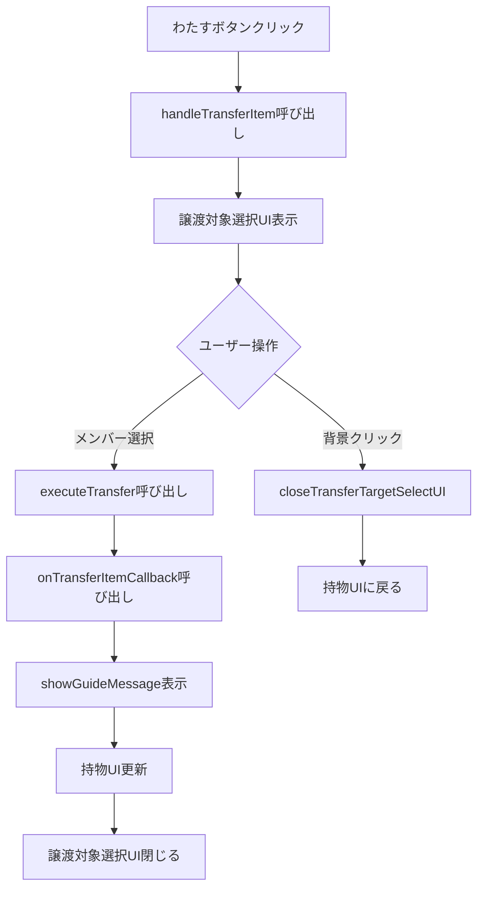

# [task-9-3-4] アイテム譲渡機能

## 概要
- エピック: #9（アイテム・装備システム）
- タスク: #9-3-4（アイテム譲渡機能）
- 関連PR/要件: PRD 2.1.12 持物管理システム - 6. アイテム譲渡処理

## 設計方針

### 基本方針
- **オーバーレイUI**: 持物UIの上に重ねて表示するドラクエ風レイアウト
- **直感的操作**: メンバーをクリックするだけのシンプルな操作フロー
- **制約の明示**: 所持上限や軍団人数の制約をUIで視覚的に表現
- **連続操作**: 譲渡後も持物UIに留まり、連続して譲渡可能

### 技術選定
- **UIフレームワーク**: Phaser3のGameObjects.Container
- **レイアウト**: 既存のcreateModalBackgroundパターンを踏襲
- **メッセージ表示**: UIManager.showGuideMessage()を使用

## コンポーネント設計

### 譲渡対象選択UI構造
```
ItemInventoryUI (持物UI)
  ↓
  TransferTargetSelectContainer (オーバーレイ)
    ├── overlayBackground (半透明黒背景)
    ├── selectPanel (選択パネル)
    │   ├── titleText ("誰に渡しますか？")
    │   ├── memberButton1 ("太郎（3/4）")
    │   ├── memberButton2 ("次郎（4/4）" - グレーアウト)
    │   └── memberButton3 ("三郎（1/4）")
    └── closeArea (背景外クリックで閉じる)
```

### 状態管理
```typescript
// ItemInventoryUIに追加するプロパティ
private transferTargetSelectContainer?: Phaser.GameObjects.Container;
private transferringItem?: IItem;
private transferringCharacter?: Character;
```

## インターフェース定義

### 既存インターフェースの拡張
```typescript
// ItemButtonStateのtransferフィールドを有効化
interface ItemButtonState {
  transfer: {
    enabled: boolean;  // 軍団メンバーが2名以上の場合true
    text: string;      // "わたす"
    callback?: () => void;
  };
}
```

## イベントフロー

### 譲渡操作の流れ


### 詳細フロー

1. **「わたす」ボタンクリック**
   - `handleTransferItem(from: Character, item: IItem)`が呼ばれる
   - 譲渡元と譲渡アイテムを保存
   - `createTransferTargetSelectUI()`を呼び出し

2. **譲渡対象選択UI表示**
   - 半透明黒のオーバーレイ背景を作成
   - 選択パネルを中央に配置
   - 軍団メンバー（自分以外）のボタンリストを表示
   - 各ボタンに所持数（X/4）を表示
   - 所持上限（4個）のメンバーはグレーアウト

3. **譲渡先選択**
   - メンバーボタンをクリック
   - `executeTransfer(to: Character)`が呼ばれる
   - `onTransferItemCallback(from, to, item)`を呼び出し
   - `showGuideMessage("{アイテム名}を{渡す相手}に渡しました")`
   - 持物UIを更新（`updateDisplay()`）
   - 譲渡対象選択UIを閉じる

4. **キャンセル**
   - 背景外クリックまたは右クリック
   - `closeTransferTargetSelectUI()`が呼ばれる
   - 譲渡対象選択UIを閉じる
   - 持物UIに戻る

## 実装詳細

### getButtonState()の修正
```typescript
private getButtonState(item: IItem, character: Character): ItemButtonState {
  const isConsumable = item.type === ItemType.CONSUMABLE;
  const isWeapon = item.type === ItemType.WEAPON;
  const isEquipped = character.getItemHolder().getEquippedWeapon() === item;

  // 軍団メンバーが2名以上の場合のみ譲渡可能
  const canTransfer = this.armyMembers.length >= 2;

  return {
    use: { /* 既存実装 */ },
    equip: { /* 既存実装 */ },
    transfer: {
      enabled: canTransfer,
      text: 'わたす',
      callback: canTransfer ? () => this.handleTransferItem(character, item) : undefined
    }
  };
}
```

### createTransferTargetSelectUI()の実装
```typescript
private createTransferTargetSelectUI(from: Character, item: IItem): void {
  // 1. オーバーレイ背景作成（半透明黒、インタラクティブ）
  // 2. 選択パネル作成（中央配置、白背景）
  // 3. タイトルテキスト表示（"誰に渡しますか？"）
  // 4. 軍団メンバーリスト表示（自分以外）
  //    - メンバー名と所持数表示（"太郎（3/4）"）
  //    - 所持上限チェック（4個の場合グレーアウト）
  //    - クリックで譲渡実行
  // 5. 背景クリックで閉じる処理
  // 6. 最前面に表示（depth設定）
}
```

### executeTransfer()の実装
```typescript
private executeTransfer(to: Character): void {
  if (!this.transferringItem || !this.transferringCharacter) return;

  const from = this.transferringCharacter;
  const item = this.transferringItem;

  // 譲渡先の所持数チェック（念のため再確認）
  if (to.getItemHolder().items.length >= 4) {
    console.log(`[ItemInventoryUI] 譲渡失敗: ${to.getName()}の持物が満杯です`);
    return;
  }

  // UIManagerのコールバック呼び出し
  if (this.onTransferItemCallback) {
    this.onTransferItemCallback(from, to, item);
  }

  // メッセージ表示
  const message = `${item.name}を${to.getName()}に渡しました`;
  // UIManager経由でshowGuideMessageを呼び出す必要あり

  // UI更新
  this.updateDisplay();

  // 譲渡対象選択UIを閉じる
  this.closeTransferTargetSelectUI();
}
```

### closeTransferTargetSelectUI()の実装
```typescript
private closeTransferTargetSelectUI(): void {
  if (this.transferTargetSelectContainer) {
    this.transferTargetSelectContainer.destroy();
    this.transferTargetSelectContainer = undefined;
  }
  this.transferringItem = undefined;
  this.transferringCharacter = undefined;
}
```

## UIレイアウト仕様

### 譲渡対象選択パネル
- **サイズ**: 300px × 軍団人数に応じた可変高さ
- **配置**: 画面中央
- **背景色**: 白（0xffffff）、透明度0.95
- **枠線**: 黒、2px

### メンバーボタン
- **サイズ**: 260px × 40px
- **配置**: 垂直に並べる、間隔10px
- **通常状態**: 白背景、黒文字
- **ホバー状態**: 薄い青背景（0xccddff）
- **グレーアウト**: 灰色背景（0xcccccc）、灰色文字（0x888888）
- **テキスト**: "{キャラクター名}（{所持数}/4）"

### オーバーレイ背景
- **サイズ**: 画面全体
- **背景色**: 黒（0x000000）、透明度0.5
- **クリック**: 閉じる処理

## エラーケースの処理

### 軍団が1名のみ
- `getButtonState()`で`transfer.enabled = false`
- 「わたす」ボタンをグレーアウト表示
- クリック不可

### 全員が所持上限
- 譲渡対象選択UIで全メンバーボタンをグレーアウト
- クリックしても何も起こらない

### 装備中の武器を譲渡
- 譲渡時に自動的に装備解除
- UIManagerのコールバック内で処理（既存実装を確認）

## テスト方針

### 統合テストの観点
1. **基本的な譲渡**
   - アイテムが正しく譲渡される
   - 譲渡元からアイテムが削除される
   - 譲渡先にアイテムが追加される

2. **所持上限チェック**
   - 4個所持しているメンバーはグレーアウト
   - グレーアウトされたボタンはクリック不可

3. **軍団1名時のグレーアウト**
   - 1名のみの軍団では「わたす」ボタンがグレーアウト

4. **装備中武器の譲渡**
   - 装備中の武器を譲渡すると自動的に装備解除される

5. **UIキャンセル**
   - 背景クリックでUIが閉じる
   - 右クリックでUIが閉じる

6. **連続譲渡**
   - 譲渡後も持物UIが開いたまま
   - 続けて別のアイテムを譲渡できる

7. **メッセージ表示**
   - 譲渡成功時にガイドメッセージが表示される
   - メッセージは2秒後に自動的に消える

## 未解決事項
- [x] UIManagerからshowGuideMessageを呼び出す方法（UIManagerへの参照を保持）
- [ ] 譲渡時のアニメーション演出（将来検討）
- [ ] 戦闘中の譲渡制限（将来検討）
