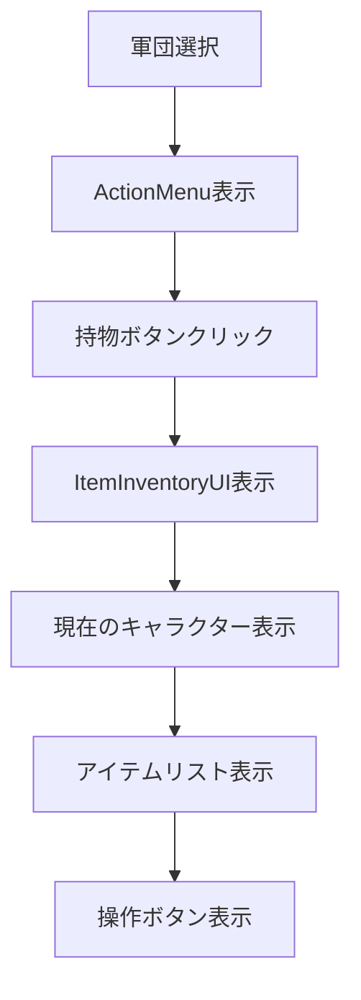

# [task-9-3] 持物管理システム

## 概要
- エピック: #9（アイテム・装備システム）
- タスク: #9-3（持物管理システム）
- 関連PR/要件: PRD 2.1.12 持物管理システム

## 設計方針

### 基本方針
- **既存UIパターンの踏襲**: ItemSelectionUIやActionMenuなど既存コンポーネントのデザインパターンを継承
- **段階的実装アプローチ**: 4つのサブタスクに分割し、各機能を独立して実装可能に
- **拡張性の確保**: 将来のアイテム譲渡機能などを考慮した設計

### 技術選定
- **UIフレームワーク**: Phaser3のGameObjects.Container
- **状態管理**: 各コンポーネント内でローカル管理
- **イベント処理**: コールバックパターンによる疎結合

## コンポーネント構成

### ItemInventoryUI（新規作成）
**責務**: 軍団メンバーの持物を表示し、アイテム操作を提供
- 軍団メンバーの持物表示
- キャラクター切り替え機能（ページネーション）
- アイテム操作ボタンの表示と制御
- モーダルウィンドウとしての振る舞い

### ActionMenuの拡張
**変更内容**: 「持物」オプションの追加
- 既存のボタン配列に「持物」を追加（駐留ボタンの前）
- onInventoryコールバックの追加
- ボタン数に応じたメニュー高さの自動調整

### UIManagerの拡張
**変更内容**: ItemInventoryUIの管理機能追加
- ItemInventoryUIインスタンスの管理
- show/hideメソッドの実装
- ActionMenuとの連携設定

## インターフェース定義

### ItemInventoryConfig
```typescript
interface ItemInventoryConfig {
  scene: Phaser.Scene;
  x: number;
  y: number;
  army: Army;
  onClose?: () => void;
  onUseItem?: (character: Character, item: IConsumable) => void;
  onEquipWeapon?: (character: Character, weapon: IWeapon) => void;
  onTransferItem?: (from: Character, to: Character, item: IItem) => void;
}
```

### ItemButtonState
```typescript
interface ItemButtonState {
  use: {
    enabled: boolean;
    text: string;
    callback?: () => void;
  };
  equip: {
    enabled: boolean;
    text: string;
    callback?: () => void;
  };
  transfer: {
    enabled: boolean;
    text: string;
    callback?: () => void;
  };
}
```

## イベントフロー

### UI表示フロー


### ボタンクリック処理
1. **使用ボタン**: 消耗品の場合のみ有効 → onUseItemコールバック呼び出し
2. **装備ボタン**: 未装備武器の場合のみ有効 → onEquipWeaponコールバック呼び出し
3. **渡すボタン**: 常に無効（グレーアウト）→ 将来実装用

### キャンセル処理
- 右クリック: UIを閉じる
- ESCキー: UIを閉じる
- 画面外クリック: UIを閉じる

## 実装詳細

### ボタン有効/無効ロジック
```typescript
private getButtonState(item: IItem, character: Character): ItemButtonState {
  const isConsumable = item.type === ItemType.CONSUMABLE;
  const isWeapon = item.type === ItemType.WEAPON;
  const isEquipped = character.getItemHolder().getEquippedWeapon() === item;

  return {
    use: {
      enabled: isConsumable,
      text: '使用',
      callback: isConsumable ? () => this.onUseItem(character, item as IConsumable) : undefined
    },
    equip: {
      enabled: isWeapon && !isEquipped,
      text: isEquipped ? '装備中' : '装備',
      callback: isWeapon && !isEquipped ? () => this.onEquipWeapon(character, item as IWeapon) : undefined
    },
    transfer: {
      enabled: false,  // 将来実装
      text: '渡す',
      callback: undefined
    }
  };
}
```

### キャラクター切り替え機能
- 左矢印: 前のキャラクターへ（ループ）
- 右矢印: 次のキャラクターへ（ループ）
- 表示形式: 「キャラクター名（職業）」

### アイテム表示形式
```
[アイテム名] [耐久度（武器のみ）]
  [使用] [装備] [渡す]
```

## テスト方針

### 統合テストのポイント
- ActionMenuから「持物」選択でUIが表示される
- キャラクター切り替えが正常に動作する
- アイテムタイプごとのボタン有効/無効が正しい
- キャンセル操作でUIが閉じる

## 未解決事項
- [ ] アイテム譲渡時のターゲット選択UI設計（task-9-3-4で対応）
- [ ] 戦闘中の使用制限の仕様（将来検討）
- [ ] アイテム使用のアニメーション演出（将来検討）